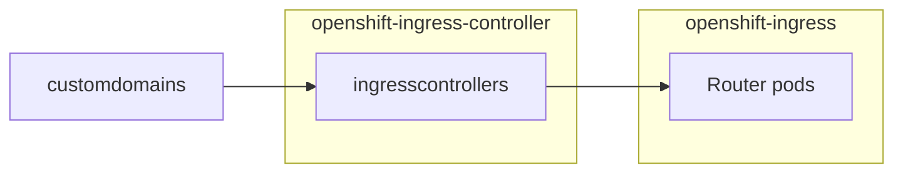

# Openshift Dedicated Custom Domain Operator

This operator sets up a [new ingresscontroller with custom certificate](https://docs.openshift.com/container-platform/4.5/networking/ingress-operator.html#nw-ingress-setting-a-custom-default-certificate_configuring-ingress) as a day-2 operation.
The public DNS record of this new ingresscontroller can then be used by external DNS to create a wildcard CNAME record to for a custom domain.

On cluster, a `CustomDomain` custom resource creates an `IngressController`, which creates a set of router pods.


### Deprecation
On versions of Managed Openshift (OSD/ROSA) greater than version 4.14 (or version 4.13 if the =ext-managed.openshift.io/legacy-ingress-support= flag is switched on for the cluster) the Custom Domains Operator will no longer reconcile new `CustomDomain` objects. Existing `CustomDomain`
 objects will be converted to native Openshift `IngressController` resources, and their `HAProxy` workloads rescheduled onto customer worker nodes. Consult https://access.redhat.com/articles/7028653 for further information.
### Prerequisites

- Go 1.19+
- Operator-SDK v1.25+

### Building And Deploying

Also see [Deploying the operator from a development branch for testing](DEPLOYING-FOR-TESTING.md)


#### Setup
Create Custom Resource Definition (CRD)
```
oc apply -f deploy/crds/managed.openshift.io_customdomains_crd.yaml
```

#### Run locally outside of cluster
```
operator-sdk run --local --namespace ''
```

#### Build and Deploy To Cluster
Choose public container registry e.g. 'quay.io/acme'.
Build and push the image, then update the operator deployment manifest.

Example:
```
# deploy manifests
oc apply -f deploy/crds/managed.openshift.io_customdomains.yaml
oc apply -f deploy/
# build
make docker-build docker-push
# update image with image in build output
oc set image -n openshift-custom-domains-operator deployment/custom-domains-operator custom-domains-operator=quay.io/dustman9000/custom-domains-operator:v0.1.29-a48b301e
```

## Testing
See [TESTING](TESTING.md)
